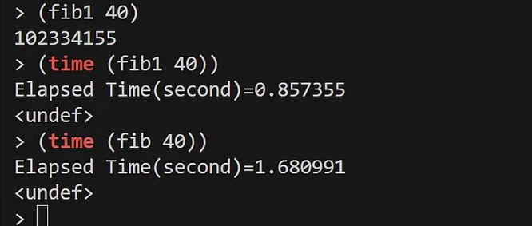

# Distributed Parallel functions


# Invoke 
eisl -n on child machine terminal.
EISL runs with network mode. 


eisl on parent machine terminal.
and (dp-create ) to establish TCP/IP between child Lisp.

# Spec

- eisl -n: Launches child Lisps in network mode with the -n option.

- (dp-create c0 c1 …cn): Provides IP addresses of child machines to establish TCP/IP communication with the parent Lisp.

- (dp-let forms body): Distributed parallel version of the let syntax.

- (dp-call fun a0 a1 ... an): Distributed parallel version of the call syntax.

- (dp-exec a0 a1 ... an): Distributed parallel version of progn

- (dp-part sw a0 a1 ... an): Sidtributed paralle version partial-execution.
Executes arg1 to argn in parallel in child Lisps.
sw == nil
If one of arg returns nil stops exections and return nil,
else  returns the result of the last execution.

sw == t
If one of arg returns non-nil stops exections and return result,
else  returns the result of the last execution.


- (dp-transfer fn): Transfers file fn to all child machines from the parent machine.

- (dp-compile fn): Compiles file fn on both parent and child machines.

- (dp-load fn): Loads file fn on both parent and child machines.

- (dp-eval n sexp): Evaluates S-expression sexp on the nth child Lisp for testing.

- (dp-report str): Display string on parent terminal.

- (dp-close): Sends termination command to child machines and closes communication.


## example

```
(defun pfib (n)
    (dp-let ((a (fib (- n 1)))
             (b (fib (- n 2))))
        (+ a b)))

(defun fib (n)
    (the <fixnum> n) 
    (cond ((= n 0) 0)
          ((= n 1) 1)
          (t (+ (fib (- n 1)) (fib (- n 2))))))

(defun ptarai (x y z)
    (the <fixnum> x)(the <fixnum> y)(the <fixnum> z)
    (if (<= x y)
        y
        (dp-call #'ptarai (tarai (- x 1) y z)
                          (tarai (- y 1) z x)
                          (tarai (- z 1) x y))))

(defun tarai (x y z)
    (the <fixnum> x)(the <fixnum> y)(the <fixnum> z)
    (if (<= x y)
        y
        (tarai (tarai (- x 1) y z)
               (tarai (- y 1) z x)
               (tarai (- z 1) x y))))

(defun pcount (n)
    (dp-exec (count1 1 (div n 2))
             (count1 (+ (div n 2) 1) n)))

(defun count (n)
    (count1 1 n))

(defun count1 (m n)
    (for ((i m (+ i 1)))
         ((= i n) t)
         (sin (cos (tan i)))))


;(dp-create "xxx.xxx.xxx.xxx" "yyy.yyy.yyy.yyy")
;(primep* 100000000000031)
(defun primep* (n)
    (cond ((= n 2) t)
          ((= (mod n 2) 0) nil)
          (t (let* ((limit (isqrt n))
                    (span (div limit 2)))
                 (dp-part nil (coprimep n 3 span)
                              (coprimep n (near-odd span) limit))))))

(defun near-odd (n)
    (if (= (mod n 2) 0)
        (- n 1)
        n))


(defun coprimep (n s e)
    (cond ((> s e) t)
          ((= (mod n s) 0) nil)
          (t (coprimep n (+ s 2) e))))

(defun primep (n)
    (cond ((= n 2) t)
          ((= (mod n 2) 0) nil)
          (t (coprimep n 3 (isqrt n)))))

(import "unistd")

(defun bar (x y)
    (dp-exec (uoo x) (uoo y)))

(defun uoo (x) 
    (let ((stm (create-string-output-stream)))
        (format stm "test1 ~A ~%" x)
        (dp-report (get-output-stream-string stm))
        (sleep 1)
        (format stm "test2 ~A ~%" x)
        (dp-report (get-output-stream-string stm))
        (sleep 1)
        t))

(defun woo (x y)
    (dp-part nil (uoo x) (uoo y)))

```




