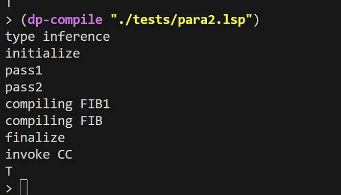
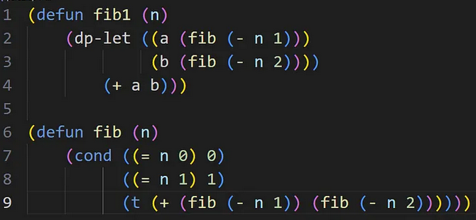

# Districuted Parallel functions
now constructing.

# Invoke 
eisl -n on child machine terminal.
EISL runs with network mode. 


eisl on parent machine terminal.
and (dp-create ) to establish TCP/IP between child Lisp.

# Spec

- eisl -n: Launches child Lisps in network mode with the -n option.

- (dp-create c0 c1 …cn): Provides IP addresses of child machines to establish TCP/IP communication with the parent Lisp.

- (dp-let forms body): Distributed parallel version of the let syntax.

- (dp-call fun a0 a1 ... an): Distributed parallel version of the call syntax.

- (dp-exec a0 a1 ... an): Distributed parallel version of progn

- (dp-part opt a0 a1 ... an): Sidtributed paralle version partial-execution.

- (dp-transfer fn): Transfers file fn to all child machines from the parent machine.

- (dp-compile fn): Compiles file fn on both parent and child machines.

- (dp-load fn): Loads file fn on both parent and child machines.

- (dp-eval n sexp): Evaluates S-expression sexp on the nth child Lisp for testing.

- (dp-close): Sends termination command to child machines and closes communication.


## example

```
(defun pfib (n)
    (dp-let ((a (fib (- n 1)))
             (b (fib (- n 2))))
        (+ a b)))

(defun fib (n)
    (the <fixnum> n) 
    (cond ((= n 0) 0)
          ((= n 1) 1)
          (t (+ (fib (- n 1)) (fib (- n 2))))))

(defun ptarai (x y z)
    (the <fixnum> x)(the <fixnum> y)(the <fixnum> z)
    (if (<= x y)
        y
        (dp-call #'ptarai (tarai (- x 1) y z)
                          (tarai (- y 1) z x)
                          (tarai (- z 1) x y))))

(defun tarai (x y z)
    (the <fixnum> x)(the <fixnum> y)(the <fixnum> z)
    (if (<= x y)
        y
        (tarai (tarai (- x 1) y z)
               (tarai (- y 1) z x)
               (tarai (- z 1) x y))))

(defun pcount (n)
    (dp-exec (count1 1 (div n 2))
             (count1 (+ (div n 2) 1) n)))

(defun count (n)
    (count1 1 n))

(defun count1 (m n)
    (for ((i m (+ i 1)))
         ((= i n) t)
         (sin (cos (tan i)))))

```






